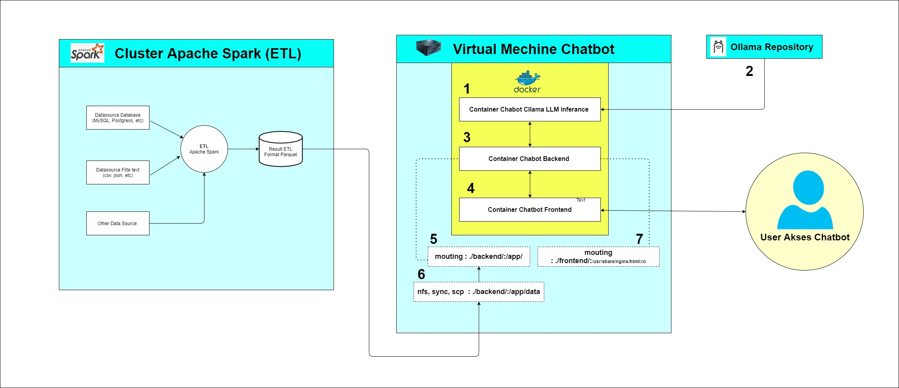
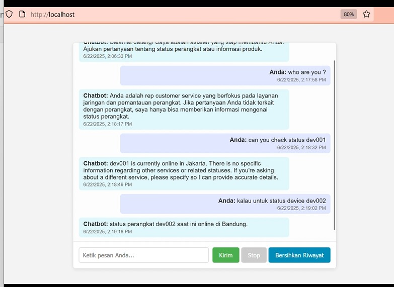
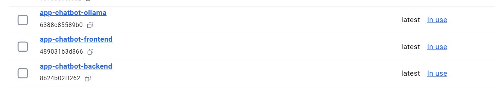
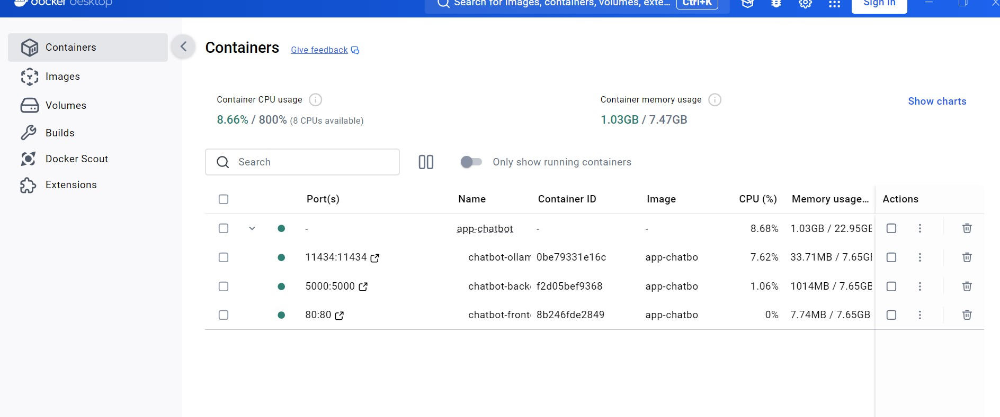
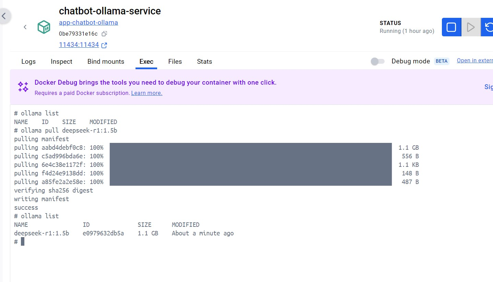

# Optimizing AI RAG Chatbot Deployment: Docker Solutions for Limited Resource Environments with External Apache Spark Data

In the context of limited computer hardware resources and restricted internet access, deploying a Retrieval-Augmented Generation (RAG)-based AI Chatbot using a Docker schema offers a highly strategic and efficient solution.

By encapsulating each application component—from locally loaded Large Language Models (LLMs) like Ollama, the RAG backend, to the application frontend—into isolated Docker containers, we can significantly optimize the utilization of limited RAM and CPU. This schema allows each service to run in its own compact environment, minimizing resource overhead and dependency conflicts that often occur in monolithic deployments.

Docker's flexibility becomes crucial when the RAG data source originates from data processed or stored using **Apache Spark**. This seamless integration can be achieved without the need to locally install a large Spark environment on every target machine. Furthermore, Docker simplifies the distribution and caching of local images, reducing the repetitive need to download large data via limited internet connections. The ability to efficiently reconfigure and maintain applications makes complex AI deployment processes lighter and more manageable, even in resource-constrained environments.






[Chatbot AI RAG Demo Video](./ss/video-demo.mp4)


## Table of Contents

1.  [Apache Spark](https://github.com/dendie-sanjaya/ai-chatboot-rag-big-data-docker#apache-spark)
2.  [AI Chatbot with RAG Using Apache Spark](https://github.com/dendie-sanjaya/ai-chatboot-rag-big-data-docker#ai-chatbot-with-rag-using-apache-spark)
3.  [Deployment of AI Chatbot with RAG Using Apache Spark](https://github.com/dendie-sanjaya/ai-chatboot-rag-big-data-docker#deployment-of-ai-chatbot-with-rag-using-apache-spark)
      * [Reasons for Deployment on Docker & Ollama](https://github.com/dendie-sanjaya/ai-chatboot-rag-big-data-docker#1-reasons-for-deployment-on-docker--ollama)
      * [Project Structure](https://github.com/dendie-sanjaya/ai-chatboot-rag-big-data-docker#2-project-structure)
      * [Deployment Steps](https://github.com/dendie-sanjaya/ai-chatboot-rag-big-data-docker#3-deployment-steps)
          * [Docker-Compose](https://github.com/dendie-sanjaya/ai-chatboot-rag-big-data-docker#1-docker-compose)
          * [Generated Docker Images](https://github.com/dendie-sanjaya/ai-chatboot-rag-big-data-docker#2-generated-docker-images)
          * [Generated Docker Services](https://github.com/dendie-sanjaya/ai-chatboot-rag-big-data-docker#3-generated-docker-services)
          * [Downloading LLM](https://github.com/dendie-sanjaya/ai-chatboot-rag-big-data-docker#4-downloading-llm)
          * [Chatbot Application Testing](https://github.com/dendie-sanjaya/ai-chatboot-rag-big-data-docker#5-chatbot-application-testing)


## Apache Spark

Apache Spark is a highly popular and powerful open-source distributed data processing framework, designed to handle various big data workloads, including **ETL (Extract, Transform, Load)**. In this guide, we will explore how to perform ETL using **Python** through the **PySpark** library.

For more information on how to perform ETL using Apache Spark, you can refer to my GitHub repository at: [https://github.com/dendie-sanjaya/apache-spark-etl](https://github.com/dendie-sanjaya/apache-spark-etl)


## AI Chatbot with RAG Using Apache Spark

Regarding how to create an AI Chatbot with RAG (Retrieval-Augmented Generation), detailed explanations and steps can be found at the following GitHub link:

[https://github.com/dendie-sanjaya/ai-chatbot-big-data-apache-spark](https://github.com/dendie-sanjaya/ai-chatbot-big-data-apache-spark)


### 1. Deployment of AI Chatbot with RAG Using Apache Spark

Docker is an open-source platform that enables developers to build, ship, and run applications in *containers*.

Imagine this:

  * **Before Docker:** When developing applications, the common problem of "it works on my machine" often arose. This meant an application perfectly functional on a developer's computer might not work in a production environment due to differences in operating systems, dependencies, or configurations.
  * **With Docker (Containers):**
      * Docker packages the application along with everything needed to run it (code, *runtime*, *system tools*, *libraries*, settings) into a single, standardized unit called a **container**.
      * Each container is isolated from other containers and from the host system, yet shares the host operating system's *kernel*.
      * This makes applications **portable**; the same container can be run in any environment with Docker, guaranteeing the application will behave consistently.
      * Docker also provides an easy way to manage these containers, such as creating, starting, stopping, and deleting them.


### 2. Reasons for Deployment on Docker & Ollama

Here are the reasons why deploying an AI RAG Chatbot with Apache Spark using Docker can be a highly effective alternative:

1.  **Limited Resources (Computer, CPU, RAM):** Docker serves as an alternative by allowing the consolidation of all services into a single, isolated server, without interfering with other parts. This is ideal for environments with minimal resources.
2.  **Ease of Deployment:** Docker simplifies the deployment process from one server to another, reducing complexity and time required.
3.  **Limited Internet Access:** If a server has a policy restricting internet access, Docker offers an alternative. We can prepare all necessary programs and dependencies in pre-packaged Docker *images*.
4.  **Ollama for LLM:** Ollama is chosen for its ease in LLM AI deployment. This platform offers many LLM options already *hosted* in its repository and optimized to run on computers that do not require high specifications.


### 3. Project Structure

Here's the directory and file structure for our project:

```
AI-CHATBOOT-RAG-BIG-DATA-DOCKER/
├── backend/
│   ├── artifacts/
│   ├── data/
│   ├── lib/
│   ├── app.py
│   ├── Dockerfile
│   ├── etl_process.py
│   ├── query_data.py
│   ├── requirements.txt
│   └── setup_db.py
├── frontend/
│   ├── Dockerfile
│   ├── index.html
│   └── nginx.conf
├── ollama/
│   └── Dockerfile
├── docker-compose.yml
├── docker-save-load.txt
└── readme.md
```


### 3. Deployment Steps

#### 1. Docker-Compose

To run the deployment, simply execute the `docker-compose up -d` command, as it contains all the necessary configurations for the deployment process.

```bash
docker-compose up -d
```


#### 2. Generated Docker Images

Upon successful deployment, 3 Docker images will be created as shown in the screenshot below:

  * `app-chatbot-frontend`: The image containing the chatbot frontend program.
  * `app-chatbot-backend`: The image containing the chatbot backend program, integrated with Apache Spark data and the Ollama LLM inference server.
  * `app-chatbot-ollama`: The image containing the Ollama LLM inference server program.




#### 3. Generated Docker Services

After the deployment process is successful, 3 running Docker services will be established, as shown in this screenshot:

  * `chatbot-frontend-service`: The chatbot frontend program.
  * `chatbot-backend-service`: The chatbot backend program integrated with Apache Spark data and the Ollama LLM inference server.
  * `chatbot-ollama-service`: The Ollama LLM inference server program.




#### 4. Downloading LLM

Within the `chatbot-ollama-service` container, perform the necessary LLM model download (`ollama pull`). As an example, we use the `deepseek-r1:1.5b` model.




#### Chatbot Application Testing

Upon successful deployment and configuration, the chatbot application will appear as follows:


## Contact

If you have questions, you can contact this email:
Email: dendie.sanjaya@gmail.com